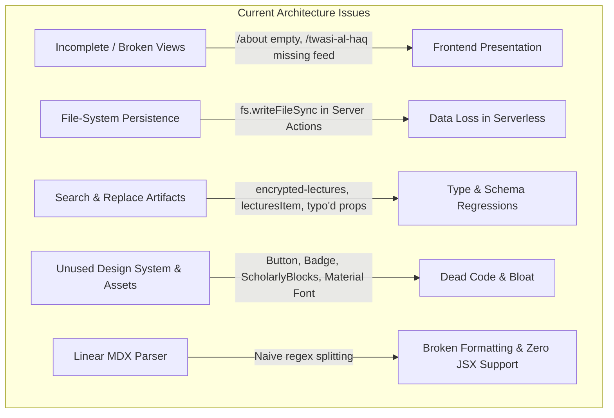

# Comprehensive Codebase Analysis & Architectural Audit: Adlwise

**Project:** Adlwise (`Adlwise.com`)
**Stack:** Next.js 16.3.4 (App Router, Turbopack), React 19.2.8, TypeScript 7.0, Tailwind CSS 3.4, Zod, Gray-Matter
**Audited Date:** 2026-09-13

---

## Executive Summary

The Adlwise codebase is a high-ambition bilingual (English / Urdu / Arabic) scholarly platform designed for classical Islamic jurisprudence, constitutional statecraft, and theological discourse. It features a modern Next.js 16 App Router foundation, structured metadata, schema validation, and an editorial design token system.

However, a deep forensic analysis of every file reveals critical functional regressions, orphaned components, architectural anti-patterns, performance bottlenecks, and leftover artifacts from a global search/replace.



---

## 1. Critical Functional Bugs & Broken Pages

### 1.1. `/about` Page is Completely Blank

- **File:** [`src/app/about/page.tsx`](file:///D:/Work/projects/Adlwise/adlwise-com/src/app/about/page.tsx#L11-L21)
- **Problem:** The page returns an empty `<div className="px-gutter-mobile ..."></div>`. Three fully designed components ([`ScholarDossier`](file:///D:/Work/projects/Adlwise/adlwise-com/src/features/about/components/ScholarDossier.tsx), [`ResearchFellows`](file:///D:/Work/projects/Adlwise/adlwise-com/src/features/about/components/ResearchFellows.tsx), and [`AcademicConsultationSection`](file:///D:/Work/projects/Adlwise/adlwise-com/src/features/about/components/AcademicConsultationSection.tsx)) were built in `src/features/about/components/` and exported via [`src/features/about/index.ts`](file:///D:/Work/projects/Adlwise/adlwise-com/src/features/about/index.ts), but were **never imported or rendered** into the page.
- **Impact:** Any user visiting `/about` sees a blank screen.

### 1.2. `/twasi-al-haq` Dispatches & Articles Never Render

- **File:** [`src/app/twasi-al-haq/page.tsx`](file:///D:/Work/projects/Adlwise/adlwise-com/src/app/twasi-al-haq/page.tsx#L19-L29)
- **Problem:**

  ```tsx
  export default async function TwasiAlHaqPage() {
    const articles = await getAllArticles();
    const leadArticle = articles[0];
    const feedArticles = articles.slice(1);

    return (
      <div className="flex flex-col w-full pb-space-2xl">
        <DiscourseHeader />
        {/* Missing <LeadDispatchCard article={leadArticle} /> */}
        {/* Missing <DispatchFeed articles={feedArticles} /> */}
      </div>
    );
  }
  ```

  `LeadDispatchCard` and `DispatchFeed` are imported from `@/features/discourse`, `articles` are fetched and sliced into `leadArticle` and `feedArticles`, but **neither component is rendered in the JSX return statement**.
- **Impact:** The entire Twasi al-Haq archive is invisible; only the top banner appears.

### 1.3. Broken Iframe Permissions Policy: `encrypted-lectures`

- **File:** [`src/components/lectures/YouTubeEmbed.tsx`](file:///D:/Work/projects/Adlwise/adlwise-com/src/components/lectures/YouTubeEmbed.tsx#L45)
- **Problem:** An automated global case-insensitive search and replace from `media` to `lectures` altered the standard W3C iframe permission:
  ```tsx
  // Current:
  allow="accelerometer; autoplay; clipboard-write; encrypted-lectures; gyroscope; picture-in-picture"
  // Correct:
  allow="accelerometer; autoplay; clipboard-write; encrypted-media; gyroscope; picture-in-picture"
  ```
- **Impact:** Browsers reject the unknown directive `encrypted-lectures`. Any DRM or encrypted media extension (EME) required by YouTube streams will fail.

### 1.4. Frontmatter Schema Mismatch in MDX

- **Files:** [`src/lib/content/schemas.ts`](file:///D:/Work/projects/Adlwise/adlwise-com/src/lib/content/schemas.ts#L29) and [`content/articles/charter-of-medina.mdx`](file:///D:/Work/projects/Adlwise/adlwise-com/content/articles/charter-of-medina.mdx#L17-L19)
- **Problem:** In `charter-of-medina.mdx`, the frontmatter specifies `relatedMediaSlugs: [...]`. In `schemas.ts`, the field was renamed to `relatedlecturesSlugs`. Because Zod defaults missing keys to `[]`, the related media references in MDX frontmatter are silently dropped.

### 1.5. Broken File Paths in OpenGraph Image Generators

- **Files:**
  - [`src/app/opengraph-image.tsx`](file:///D:/Work/projects/Adlwise/adlwise-com/src/app/opengraph-image.tsx#L17-L26)
  - [`src/app/lectures/[slug]/opengraph-image.tsx`](file:///D:/Work/projects/Adlwise/adlwise-com/src/app/lectures/[slug]/opengraph-image.tsx#L29-L38)
  - [`src/app/twasi-al-haq/[slug]/opengraph-image.tsx`](file:///D:/Work/projects/Adlwise/adlwise-com/src/app/twasi-al-haq/[slug]/opengraph-image.tsx#L32-L41)
- **Problem:** All three OG generators look for the logo badge at `path.join(process.cwd(), "public", "images", "logo-badge.png")`. The file is actually located at `public/images/assets/logo-badge.png`.
- **Impact:** The `fs.existsSync` check always fails; social preview share cards are rendered without the institute emblem.

### 1.6. Header Transparency Flaw on `/about`

- **File:** [`src/components/layout/Header.tsx`](file:///D:/Work/projects/Adlwise/adlwise-com/src/components/layout/Header.tsx#L29-L33)
- **Problem:** `isMainNavRoot` checks if `pathname` matches any item in `mainNavItems`. `/about` is in `mainNavItems`. Therefore, when unscrolled, `isTransparentHero` is true and no top spacer is rendered. However, unlike `/`, `/lectures`, or `/majlis`, `/about` has no dark hero banner. As a result, the header renders white text on a parchment (`#fff9e9`) background, rendering the navigation unreadable.

---

## 2. Performance & Code Optimizations

### 2.1. Render-Blocking Unused Font in `layout.tsx`

- **File:** [`src/app/layout.tsx`](file:///D:/Work/projects/Adlwise/adlwise-com/src/app/layout.tsx#L29-L32)
- **Issue:** The document `<head>` loads an external stylesheet from `fonts.googleapis.com` for `Material Symbols Outlined`.
- **Finding:** A full scan across the codebase reveals that **zero components** use Material Symbols. Every icon across the application is imported from `lucide-react`.
- **Fix:** Remove the external Google Fonts `<link>` tag and purge corresponding `.material-symbols-*` rules from [`globals.css`](file:///D:/Work/projects/Adlwise/adlwise-com/src/app/globals.css#L72-L94). This eliminates an external network roundtrip that delays First Contentful Paint (FCP).

### 2.2. Dual `priority` Next.js Images

- **Files:**
  - [`src/features/home/components/HeroSection.tsx`](file:///D:/Work/projects/Adlwise/adlwise-com/src/features/home/components/HeroSection.tsx#L21-L42)
  - [`src/features/majlis/components/MajlisHero.tsx`](file:///D:/Work/projects/Adlwise/adlwise-com/src/features/majlis/components/MajlisHero.tsx#L18-L40)
  - [`src/features/lectures/components/LecturesHero.tsx`](file:///D:/Work/projects/Adlwise/adlwise-com/src/features/lectures/components/LecturesHero.tsx#L18-L40)
- **Issue:** To support mobile vs. desktop art-direction, two separate `<Image>` components are rendered (one `.hidden md:block`, one `.block md:hidden`), and **both have `priority` enabled**.
- **Impact:** Next.js injects `<link rel="preload">` for BOTH images into `<head>`. Mobile clients download the 1.5MB desktop hero, and desktop clients download the mobile hero, wasting bandwidth and delaying Largest Contentful Paint (LCP).
- **Optimization:** Use a single `<Image>` tag with responsive CSS `object-position` adjustments or use standard HTML `<picture>` with `<source media="(min-width: 768px)">`.

### 2.3. Un-debounced Server Navigation on Filter Inputs

- **File:** [`src/features/lectures/components/LecturesSearchFilter.tsx`](file:///D:/Work/projects/Adlwise/adlwise-com/src/features/lectures/components/LecturesSearchFilter.tsx#L28-L38)
- **Issue:** `handleSearchChange` calls `router.replace(`/lectures?${params.toString()}`)` synchronously on every character input without debouncing.
- **Impact:** Typing a 10-letter search query generates 10 successive full Next.js server component round-trips within a second, causing network congestion and frame drops.
- **Optimization:** Add a 300ms debounce hook (e.g. `useDebounce`) or update local state first and trigger URL params navigation on debounce.

### 2.4. Quadratic In-Memory Scans in Related Content Calculation

- **File:** [`src/lib/content/related.ts`](file:///D:/Work/projects/Adlwise/adlwise-com/src/lib/content/related.ts#L120-L153)
- **Issue:** In step 3 (taxonomic scoring), the algorithm loops through all items in `pool` and for each item calls `.find()` against `articles` or `lecturesItems` to retrieve topic arrays.
- **Impact:** $O(N \times M)$ complexity.
- **Optimization:** Preserve `topics` directly on `UnifiedRelatedItem`, or index `articles` and `lecturesItems` in a `Map<string, T>` for $O(1)$ lookups.

### 2.5. Uncached Content File System I/O

- **File:** [`src/lib/content/client.ts`](file:///D:/Work/projects/Adlwise/adlwise-com/src/lib/content/client.ts#L26-L56)
- **Issue:** `getAllArticles()` and `getAllMajlisSessions()` use synchronous `fs.readdirSync` and `fs.readFileSync` with `gray-matter` and `Zod` validation on **every invocation**, without wrapping in React's `cache()` or a module-level memoization variable. In contrast, `src/lib/lectures/client.ts` properly uses `cache()`.
- **Optimization:** Wrap `getAllArticles` and `getAllMajlisSessions` with `cache()` from `"react"`.

---

## 3. Separation of Concerns & Modularity

### 3.1. Server Action Persistence Pattern (Serverless Incompatibility)

- **Files:**

  - [`src/app/actions/submit-fellowship.ts`](file:///D:/Work/projects/Adlwise/adlwise-com/src/app/actions/submit-fellowship.ts#L28-L43)
  - [`src/app/actions/submit-inquiry.ts`](file:///D:/Work/projects/Adlwise/adlwise-com/src/app/actions/submit-inquiry.ts#L25-L40)
- **Anti-Pattern:**

  ```ts
  const filePath = path.join(submissionsDir, "fellowship.json");
  let currentList: any[] = [];
  if (fs.existsSync(filePath)) {
    currentList = JSON.parse(fs.readFileSync(filePath, "utf-8"));
  }
  currentList.push(entry);
  fs.writeFileSync(filePath, JSON.stringify(currentList, null, 2), "utf-8");
  ```
- **Architectural Flaws:**

  1. **Ephemeral Filesystem:** Modern hosting platforms (Vercel, AWS Lambda, Cloud Run) have read-only or ephemeral filesystems. File writes will either throw `EROFS` or disappear upon container teardown.
  2. **Race Conditions:** Two simultaneous form submissions read `fellowship.json`, append locally, and write back, overwriting and discarding whichever request arrived milliseconds earlier.
  3. **Data Security & Git Pollution:** Writing user PII (names, phone numbers, emails, personal statements) into the codebase directory creates a severe risk of committing private user data to version control.
- **Remediation Blueprint:** Decouple data persistence behind an intake repository interface:

  ```ts
  export interface IntakeRepository {
    saveFellowship(application: FellowshipInput): Promise<{ id: string }>;
    saveInquiry(inquiry: InquiryInput): Promise<{ id: string }>;
  }
  ```

  Implement concrete adapters for Supabase/PostgreSQL, Airtable, or transactional webhooks (Resend/SendGrid/Zapier).

### 3.2. Orphaned & Competing Feature Modules

The codebase has competing feature directories created during different phases:

| Module                                                  | Status                                 | Issue                                                                                                                                                   |
| ------------------------------------------------------- | -------------------------------------- | ------------------------------------------------------------------------------------------------------------------------------------------------------- |
| `src/features/articles`                               | **Orphaned (Dead Code)**         | Contains`ArticleCard` and `ArticlesHeader`. Has 0 imports in the entire project.                                                                    |
| `src/features/discourse`                              | **Active / Partially Abandoned** | Contains`LeadDispatchCard`, `DispatchFeed`, `DiscourseFilterTabs`. Uses legacy "Dispatch" nomenclature.                                           |
| `src/components/ui/Button.tsx`                        | **Orphaned (Dead Code)**         | Fully typed reusable Button with variants (`primary`, `secondary`, `gold`), but 0 imports. Every component re-writes raw inline Tailwind strings. |
| `src/components/ui/Badge.tsx`                         | **Orphaned (Dead Code)**         | Fully typed reusable Badge component with 0 imports.                                                                                                    |
| `src/features/home/components/DiscourseHighlight.tsx` | **Orphaned (Dead Code)**         | Exported in`src/features/home/index.ts`, never placed in `HomePage`.                                                                                |
| `src/components/lectures/AudioPlayerWidget.tsx`       | **Orphaned (Dead Code)**         | Fully written interactive HTML5 audio scrubber with playback rates, 0 imports.                                                                          |

**Recommendation:** Consolidate `src/features/articles` and `src/features/discourse` into a single domain module: `src/features/articles`. Purge or integrate the orphaned components into their respective views.

### 3.3. Pseudo-MDX Renderer

- **File:** [`src/components/content/MDXRenderer.tsx`](file:///D:/Work/projects/Adlwise/adlwise-com/src/components/content/MDXRenderer.tsx)
- **Problem:** Despite its name, `MDXRenderer` is a naive regex parser splitting text by `/\n\n+/`.
  - It **cannot evaluate React/JSX components**.
  - Components [`AyatBlock.tsx`](file:///D:/Work/projects/Adlwise/adlwise-com/src/components/content/AyatBlock.tsx) and [`ScholarlyBlocks.tsx`](file:///D:/Work/projects/Adlwise/adlwise-com/src/components/content/ScholarlyBlocks.tsx) (`UrduVerse`, `CitationGloss`, `HadithBlock`) cannot be used inside any article MDX file because the renderer treats them as raw paragraphs.
  - Multi-line code blocks containing empty lines break apart.
- **Recommendation:** Replace naive regex with `next-mdx-remote/rsc` or compile MDX via `@mdx-js/mdx` with `remark-gfm` and custom component injection.

---

## 4. Scalability & System Architecture

### 4.1. Lectures Catalog Architecture

- **File:** [`src/lib/lectures/catalog.json`](file:///D:/Work/projects/Adlwise/adlwise-com/src/lib/lectures/catalog.json) (12,649 lines, 680 KB)
- **Issue:** Currently, 593 lectures are bundled directly into the server JavaScript bundle via static JSON import.
- **Scalability Limit:** While 600 items are manageable in memory (~2MB heap), this design does not scale cleanly to thousands of lectures or multiple channels.
- **Blueprint:**

  ```mermaid
  flowchart LR
      YT[YouTube API Sync] -->|sync-youtube.mjs| DB[(SQLite / PostgreSQL / Cloudflare D1)]
      DB -->|Kysely / Drizzle ORM| SVR[Next.js Server Components]
      SVR -->|Cache tag / revalidate| CDN[Edge Cache]
  ```

  Transitioning `catalog.json` to an embedded SQLite database (via `better-sqlite3` or Cloudflare D1 / Turso) allows instant indexed SQL queries (`SELECT ... WHERE category = ? ORDER BY publishedAt DESC LIMIT 12 OFFSET 24`) rather than filtering large in-memory arrays.

### 4.2. Search Scalability

- **File:** [`src/lib/search/local-provider.ts`](file:///D:/Work/projects/Adlwise/adlwise-com/src/lib/search/local-provider.ts)
- **Issue:** `LocalSearchProvider` reconstructs the entire search pool on every API search request and performs linear `.includes()` string matching across 5 fields.
- **Advantage of Existing Design:** The codebase already defined an abstraction interface [`SearchProvider`](file:///D:/Work/projects/Adlwise/adlwise-com/src/lib/search/types.ts) and a factory [`createSearchProvider`](file:///D:/Work/projects/Adlwise/adlwise-com/src/lib/search/service.ts).
- **Recommended Provider:** Implement an in-memory inverted index using `MiniSearch` or `FlexSearch`, with pre-tokenized Urdu and English stems:
  ```ts
  import MiniSearch from "minisearch";

  const miniSearch = new MiniSearch({
    fields: ["title", "urduTitle", "excerpt", "tags"],
    storeFields: ["type", "id", "title", "url", "category", "date"],
    searchOptions: { boost: { title: 2, urduTitle: 2 }, prefix: true, fuzzy: 0.2 }
  });
  ```

---

## 5. Variable Naming, Typographical & Code Smells

### 5.1. Artifacts of Case-Insensitive Global Search/Replace

An automated find/replace of `media` -> `lectures` produced numerous naming anomalies:

| Current Variable / Type                 | Correct Standard Name       | Location                                     |
| --------------------------------------- | --------------------------- | -------------------------------------------- |
| `lecturesItem`                        | `LectureItem`             | `src/lib/lectures/types.ts`                |
| `lecturesSpeaker`                     | `LectureSpeaker`          | `src/lib/lectures/types.ts`                |
| `PaginatedlecturesResult`             | `PaginatedLecturesResult` | `src/lib/lectures/types.ts`                |
| `getAlllectures`                      | `getAllLectures`          | `src/lib/lectures/client.ts`               |
| `getlecturesBySlug`                   | `getLecturesBySlug`       | `src/lib/lectures/client.ts`               |
| `getFeaturedlectures`                 | `getFeaturedLectures`     | `src/lib/lectures/client.ts`               |
| `getRecentlectures`                   | `getRecentLectures`       | `src/lib/lectures/client.ts`               |
| `relatedlecturesSlugs`                | `relatedLectureSlugs`     | `src/lib/content/schemas.ts`               |
| `encrypted-lectures`                  | `encrypted-media`         | `src/components/lectures/YouTubeEmbed.tsx` |
| `const med = lecturesItems.find(...)` | `const lecture = ...`     | `src/lib/content/related.ts`               |

### 5.2. Lorem Ipsum & Unfinished Copy in Production Components

Several user-facing pages contain raw placeholder copy:

- **`FeaturedTreatiseCard.tsx` (line 25):**
  `“Dolor dolore est voluptate adipisicing adipisicing aliquip officia esse..”`
- **`SynthesisSection.tsx` (lines 10, 15, 20):**
  `"Adipisicing esse et in sint sunt. Non enim est tempor adipisicing. Deserunt voluptate non eu ex minim dolor anim..."`
- **`join/page.tsx` (line 22):**
  `"Join us on academic fellowship dedicated to ........."`
- **`lectures/[slug]/page.tsx` (line 157):**
  Header typo: `Realted Episodes` (should be `Related Episodes`).

### 5.3. Invalid Tailwind Classes

The following classes exist in JSX but are **not configured** in `tailwind.config.ts` or default Tailwind:

- `text-12xl` in [`DiscourseHeader.tsx`](file:///D:/Work/projects/Adlwise/adlwise-com/src/features/discourse/components/DiscourseHeader.tsx#L53) (Tailwind stops at `text-9xl`).
- `w-4.5` in [`ArticleCard.tsx`](file:///D:/Work/projects/Adlwise/adlwise-com/src/features/articles/components/ArticleCard.tsx#L82) (Tailwind default is `w-4` or `w-5`).
- `min-h-11` in [`error.tsx`](file:///D:/Work/projects/Adlwise/adlwise-com/src/app/error.tsx#L124) (`min-h-*` does not have an `11` step without `theme.extend.minHeight`).

---

## 6. SEO, Schema & Accessibility Audit

### 6.1. Missing Majlis Routes in `sitemap.ts`

- **File:** [`src/app/sitemap.ts`](file:///D:/Work/projects/Adlwise/adlwise-com/src/app/sitemap.ts#L3)
- **Issue:** `getAllMajlisSessions` is imported on line 3, but the sessions array is **never mapped into `sitemap()`**. All `/majlis/[slug]` URLs are absent from `sitemap.xml`.

### 6.2. Hardcoded Absolute Hostnames

- **Files:**
  - [`src/app/twasi-al-haq/[slug]/page.tsx`](file:///D:/Work/projects/Adlwise/adlwise-com/src/app/twasi-al-haq/[slug]/page.tsx#L63-L75)
  - [`src/app/lectures/[slug]/page.tsx`](file:///D:/Work/projects/Adlwise/adlwise-com/src/app/lectures/[slug]/page.tsx#L78-L84)
- **Issue:** URLs are hardcoded as `https://Adlwise.com/...` rather than using `siteConfig.url`. This breaks canonical tags and JSON-LD schemas in staging, preview deployments, or local testing environments.

### 6.3. Script Injection Sanitization in JSON-LD

- **File:** [`src/lib/seo/jsonld.tsx`](file:///D:/Work/projects/Adlwise/adlwise-com/src/lib/seo/jsonld.tsx)
- **Issue:** `dangerouslySetInnerHTML={{ __html: JSON.stringify(schema) }}` is vulnerable to script breakouts if user-provided or scraped YouTube descriptions contain `</script>`.
- **Fix:** Replace `<` with `\u003c`:
  ```tsx
  dangerouslySetInnerHTML={{
    __html: JSON.stringify(schema).replace(/</g, "\\u003c"),
  }}
  ```

---

## 7. Actionable Roadmap & Priority Matrix

|   Priority   | Task                                                                   | Target File(s)                                                | Impact                                            |
| :----------: | ---------------------------------------------------------------------- | ------------------------------------------------------------- | ------------------------------------------------- |
| **P0** | Populate`/about/page.tsx` with dossier & consultation sections       | `src/app/about/page.tsx`                                    | Fixes completely empty page                       |
| **P0** | Render`LeadDispatchCard` & `DispatchFeed` in `/twasi-al-haq`     | `src/app/twasi-al-haq/page.tsx`                             | Fixes missing articles archive                    |
| **P0** | Correct`encrypted-lectures` -> `encrypted-media` in iframe         | `src/components/lectures/YouTubeEmbed.tsx`                  | Restores video permissions                        |
| **P0** | Update OG image badge path to`public/images/assets/logo-badge.png`   | `src/app/**/opengraph-image.tsx`                            | Fixes social share previews                       |
| **P1** | Remove render-blocking Material Symbols stylesheet                     | `src/app/layout.tsx`, `globals.css`                       | Accelerates FCP & eliminates dead network request |
| **P1** | Add`/majlis/[slug]` to sitemap generation                            | `src/app/sitemap.ts`                                        | Restores search indexing for Majlis               |
| **P1** | Replace Lorem Ipsum copy with authentic scholarly text                 | `FeaturedTreatiseCard`, `SynthesisSection`, `join/page` | Professional brand presentation                   |
| **P1** | Debounce filter & search input on`/lectures`                         | `LecturesSearchFilter.tsx`                                  | Prevents server query flooding                    |
| **P2** | Refactor naming convention (`lecturesItem` -> `LectureItem`, etc.) | `types.ts`, `client.ts`, `schemas.ts`                   | Eliminates tech debt & type bugs                  |
| **P2** | Abstract persistence in`submit-fellowship` & `submit-inquiry`      | `src/app/actions/*`                                         | Serverless compatibility & concurrency safety     |
| **P2** | Replace naive regex MDX parser with`next-mdx-remote`                 | `MDXRenderer.tsx`                                           | Enables Quranic & Scholarly blocks                |
| **P3** | Adopt unified design components (`Button`, `Badge`) across views   | `src/components/ui/*`                                       | Codebase DRYness & consistency                    |
